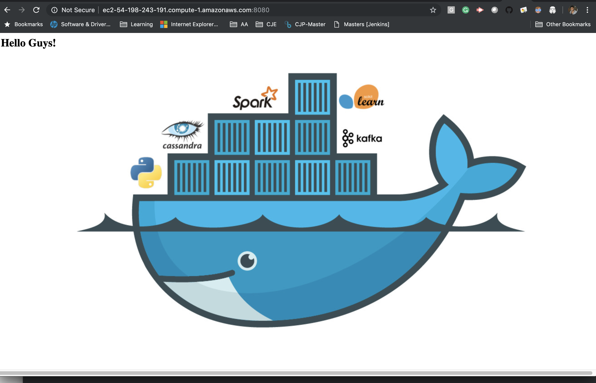

# CI-CD with Docker
Here is the step by step instructions to host a highly available website.

## Pre-requisites
1. Create an account in dockerhub
2. Machine with Jenkins up and running
3. An agent with docker running
4. Install the `git` and `java` in Agent
5. Add this Agent to Jenkins with the label called `docker`
6. Edit the Agent's Security Group Inbound rules by allowing traffic on **8080, 8081, 8082** custom ports.


## Creating Nginx Loadbalancer
Execute the following on `agent`
1. Create a directory called `nginx` and change into it.
2. Create a file called `nginx.conf` with following contents
```
upstream backend {
    server GATEWAYIP:8081;
    server GATEWAYIP:8082;
}

server {
    location / {
       proxy_pass http://backend;
    }
}
``` 
3. Get the Docker default gateway IP by running below command on docker agent.
```
GATEWAY=$(docker network inspect bridge | grep -i gateway | awk '{print $2}' | sed -e 's/,$//' -e 's/^"//' -e 's/"$//')
```
4. Replace the GATEWAYIP with the gateway ip.
```
sed -i 's/GATEWAYIP/'"$GATEWAY"'/g' nginx.conf
```
5. Confirm the GATEWAYIP is replaced with the actual ip address in nginx.conf.
6. Create a Dockerfile with following content
```Dockerfile
FROM nginx
LABEL owner=loki
LABEL desc="Nginx LoadBalancer"
RUN rm -rf /etc/nginx/conf.d/default.conf
COPY ./nginx.conf /etc/nginx/conf.d/default.conf
```
7. Create the docker image.  Pls replace the registry with your registry
```
docker build -t lokeshkamalay/nginx:latest .
```
8. Store the image in `Dockerhub`
```
docker push lokeshkamalay/nginx:latest
```

## Creating a Jenkins Pipeline
1. Setup a Jenkins Pipeline job with `Pipeline Script from SCM`
2. Choose repo as `https://github.com/lokeshkamalay/tomcat_maven_app.git`
3. Ensure the agent running docker is configured with the label `docker`
4. Create a credential with the name of `docker-hub` and input docker hub username and password.
5. Run the Job

## Results
1. Confirm the job has run successful
2. Access your website with the Agent's Public IP on port 8080.

