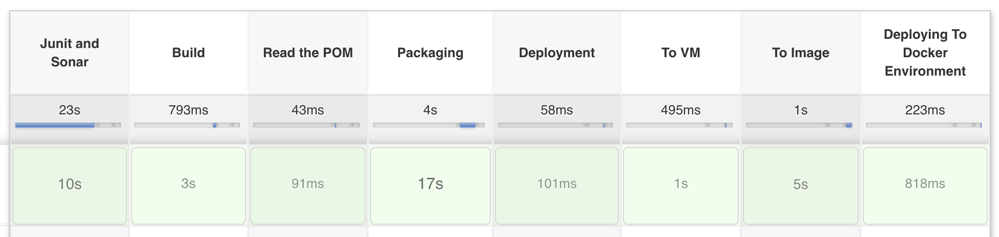
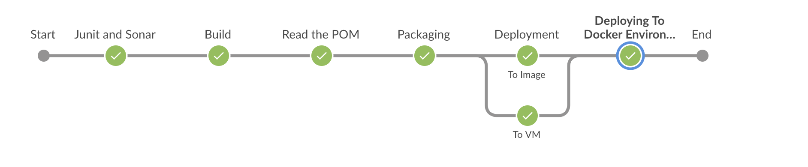

# Final Project
This project covers following.
- Junit Results
- SonarQube Analysis
- Parellel Stages
- Docker Agents
- Securing Artifacts
- Deploying to a VM
- Deploying into an Image
- Running an Image

## Pre-requisites
### Setup
- Install pipeline utilities, sshagent, docker-pipeline
- An agent running `Docker` with label `dockernode`
- Another agent with tomcat8-webapps installed
- Create credentials for SonarQube (sonar-login)
- Create credentials for DockerHub (docker-hub)
- Running instance of SonarQube
- Running instance of Artifactory

### Updating files
- Jenkinsfile
  - Update the environment block
- Pom
  - Update the distribution Management details
- Settings
  - Update the mirror and server section
### How does it work
1. Create a Jenkins pipeline sourcing gitScm

### Result

